# Writing Pythonic Code: Features That Make Python Powerful

> Performance-Based Learning course plan, written retroactively after two
> live deliveries (PyTexas 2024, PyCon US 2026). Every learning activity
> serves an objective; every objective serves a competency; every
> competency is assessed.

## Metadata

- **Heritage name:** Python 102: Beyond the Basics (used at PyTexas 2024)
- **Description:** A 3.5-hour hands-on tutorial that takes Python developers past fundamentals into idiomatic, Pythonic feature use. Covers first-class functions, decorators and closures, comprehensions, dunder methods and operator overloading, and context managers. Inspired by *Fluent Python* (Ramalho).
- **Author:** Mason Egger
- **Target learner:** Working Python developer with "some experience." Comfortable with functions, classes, loops, and basic OOP. Has not yet internalized the language's higher-order idioms. Often a backend or general-purpose engineer who learned Python on the job and now wants to read and write more Pythonic code.
- **Dreyfus stage:** Advanced Beginner
- **Format:** Hybrid — live 3.5-hour workshop *and* fully self-paced via Jupyter notebooks (Google Colab). The same artifact serves both.
- **Estimated instruction time:** 3.5 hours
- **First delivery:** April 19, 2024 — PyTexas 2024, Austin (as "Python 102: Beyond the Basics")
- **Most recent delivery:** May 14, 2026 — PyCon US 2026, Long Beach (as "Writing Pythonic Code")
- **Last updated:** 2026-05-10

## Program Outcomes This Course Supports

This is a community-taught course in idiomatic Python. The program-level outcomes it contributes to:

- Demonstrate fluency with the Python language features that distinguish idiomatic Python from generic procedural code
- Recognize and apply common Python design idioms (higher-order functions, decorators, comprehensions, the data model, context managers)
- Read and reason about Python code that uses advanced language features
- Improve existing Python code by replacing verbose patterns with idiomatic equivalents

## External Standards

No formal external standards. The course aligns with:

- Python Software Foundation Code of Conduct (community delivery context)
- PyCon tutorial format (3-hour or 3.5-hour slot, hands-on)
- Python 3.14 syntax and standard library

## Course Style — Pedagogical Patterns

These are deliberate stylistic choices that distinguish this course; future revisions should preserve them.

- **Code sandwich.** Every code block on a slide exists as an executable cell in the matching notebook. The learner runs each line as it's revealed. Slides narrate; notebooks provide the runtime.
- **Recognition openers.** Each section opens with a code snippet the learner has likely seen in the wild (`@app.route`, `with open(...)`, etc.) before introducing mechanics. Adult-learning "what's in it for me" pattern.
- **Problem-driven mechanics.** Closures are taught as a *response* to a posed problem (a counter that needs persistent state) rather than as an isolated language feature.
- **Mid-section detours with Monty Python flavor.** "And now for something completely different..." segues out of decorators to teach scoping, then back. Voice has personality; trust between narrator and audience is part of the design.
- **Show-and-fail antipatterns.** When teaching `__call__`, the course shows the feature, demonstrates a tempting use, then reflects on why a Pythonista wouldn't reach for it. This traces the real learner journey (curiosity → adoption → second thoughts) instead of prescribing avoidance.
- **Progressive code reveals.** Slide-level `[.code-highlight: N]` directives walk the learner through a code block line by line, reducing split-attention load.
- **Multi-slide summary stacks before each exercise.** Spaced-repetition reinforcement of the section's concepts immediately before the assessment.
- **Explicit success criteria on every exercise slide.** Learners see the bar before they start ("You'll know you've succeeded when...").

## Competencies

Five competencies, mapping 1:1 to the five course modules.

---

### 1. Use Python's first-class function model to pass, return, and store functions as data

#### Learning Objectives

1. Assign a function to a variable
2. Pass a function as an argument to another function
3. Return a function from a function
4. Store a function in a data structure
5. Use higher-order functions from the standard library (`map`, `filter`, `sorted`, `reduce`)
6. Pass `*args` and `**kwargs` through function signatures
7. Write a `lambda` (anonymous) function for inline use cases
8. Inspect functions and classes using `dir()` and `help()`

#### Performance Assessment

**Condition:** Open `Exercises/Practice/01-First-Class-Functions-Exercises.ipynb` in Google Colab or Jupyter using Python 3.14. Slide deck and Content notebook are open-book. Time-boxed to 10 minutes in the live workshop; untimed for self-paced learners.

**Criteria — performance will be successful when:**

- `apply_operation(add, 3, 5)` returns `8` and `apply_operation(multiply, 3, 5)` returns `15`
- A `lambda` passed to `filter` returns `[2, 8, 6, 10]` from the input `[2, 15, 8, 12, 6, 10, 18]`
- A `lambda` passed as the `key` to `sorted` orders a list of student dicts by the `age` key ascending

#### Learning Activities

| #   | Activity                                                                          | Type                              | Covers objectives  |
| :-- | :-------------------------------------------------------------------------------- | :-------------------------------- | :----------------- |
| 1.1 | First-Class Functions intro — definition + 4 properties                            | Mini-lecture                      | 1, 2, 3, 4         |
| 1.2 | Functions as objects (variable assignment, definition, passing, returning, dicts) | Worked example (code-sandwich)    | 1, 2, 3, 4         |
| 1.3 | Higher-order functions in the standard library (`sorted` with `key=len`)           | Worked example                    | 5                  |
| 1.4 | `*args` and `**kwargs` passthrough                                                 | Worked example                    | 6                  |
| 1.5 | `lambda` functions — inline + as a `sorted` key                                    | Worked example                    | 7                  |
| 1.6 | Function introspection with `dir()` and `help()`                                   | Demo                              | 8                  |
| 1.7 | **Exercise 1** — HOF + `filter`/`sorted` lambdas                                   | Hands-on exercise (assessment)    | 1, 2, 5, 7         |

---

### 2. Build decorators that wrap functions to extend their behavior, using closures to maintain state across calls

#### Learning Objectives

1. Apply a decorator to a function using `@` syntax
2. Identify decorators as syntactic sugar for higher-order functions
3. Pass parameters through a decorator's wrapper function
4. Distinguish free, local, and global variables in Python's scoping model
5. Use the `global` keyword to allow modification of a global variable from inside a function
6. Use the `nonlocal` keyword to allow inner functions to modify enclosing-scope variables
7. Implement a closure to maintain state across calls
8. Combine closures with decorators to add stateful behavior
9. Chain multiple decorators on a single function
10. Implement a parameterized decorator using a wrapping function

#### Performance Assessment

**Condition:** Open `Exercises/Practice/02-Decorators-and-Closures.ipynb` using Python 3.14. Open-book. Live time-box: 10 minutes; untimed for self-paced.

**Criteria:**

- The `@debug` decorator prints the decorated function's name, its arguments, and its return value, then returns the value unchanged
- The `@previous` decorator returns the result of the previous invocation (any value on the first call), implemented with a closure using `nonlocal`

#### Learning Activities

| #    | Activity                                                                  | Type                              | Covers objectives  |
| :--- | :------------------------------------------------------------------------ | :-------------------------------- | :----------------- |
| 2.1  | Recognition opener — decorators in the wild (`@app.route`)                 | Recognition opener                | 1                  |
| 2.2  | Decorator syntax + as syntactic sugar for HOFs                             | Mini-lecture                      | 1, 2               |
| 2.3  | Decorator with replaced behavior (the throwaway)                           | Worked example                    | 1, 3               |
| 2.4  | Decorator as enhancement (the reverse decorator)                           | Worked example                    | 3                  |
| 2.5  | When are decorators run? (import time)                                     | Demo                              | 1                  |
| 2.6  | Variable scoping — free, local, global; the `global` keyword               | Mini-lecture + worked examples    | 4, 5               |
| 2.7  | Closures — motivation (counter problem) and mechanics with `nonlocal`      | Problem-driven worked example     | 6, 7               |
| 2.8  | Closures + decorators (`count_calls` with stateful tracker)                | Worked example                    | 7, 8               |
| 2.9  | Chaining decorators                                                        | Worked example                    | 9                  |
| 2.10 | Parameterized decorators                                                   | Worked example                    | 10                 |
| 2.11 | **Exercise 2** — debug decorator + previous-result decorator               | Hands-on exercise (assessment)    | 1, 3, 7, 8         |

---

### 3. Use comprehensions to construct new sequences (lists, dicts, sets, generators) from existing iterables

#### Learning Objectives

1. Identify the three parts of a comprehension (result expression, iteration, conditional)
2. Write a list comprehension to filter or transform a sequence
3. Write a dictionary comprehension to construct a mapping
4. Write a set comprehension to deduplicate values
5. Write a generator comprehension for memory-efficient iteration
6. Use nested iteration in a comprehension to produce a Cartesian product

#### Performance Assessment

**Condition:** Open `Exercises/Practice/03-Comprehensions.ipynb` using Python 3.14. Open-book. Live time-box: 10 minutes; untimed for self-paced.

**Criteria:**

- Initials list comprehension produces `['ME', 'CW', 'LR', 'PK']` from the input names list
- Vowel comprehension returns each vowel that appears in the string exactly once
- Class/race comprehension produces every possible class+race combination

#### Learning Activities

| #   | Activity                                                                | Type                           | Covers objectives  |
| :-- | :---------------------------------------------------------------------- | :----------------------------- | :----------------- |
| 3.1 | Recognition opener — even-numbers loop vs comprehension                  | Recognition opener             | 1, 2               |
| 3.2 | Comprehension parts (result, iteration, conditional)                     | Mini-lecture                   | 1                  |
| 3.3 | Cartesian products with comprehensions (cards example)                   | Worked example                 | 6                  |
| 3.4 | Dictionary comprehensions (state/city `zip`)                             | Worked example                 | 3                  |
| 3.5 | Set comprehensions — deduplication                                       | Worked example                 | 4                  |
| 3.6 | Generator comprehensions — memory savings                                | Worked example                 | 5                  |
| 3.7 | **Exercise 3** — initials, vowels, DnD class/race                        | Hands-on exercise (assessment) | 1, 2, 4, 6         |

---

### 4. Implement dunder methods to make custom objects interoperate with Python's built-in operators and functions

#### Learning Objectives

1. Identify the role of dunder methods in Python's data model
2. Implement `__init__` to initialize an object's state
3. Implement `__str__` and `__repr__` to control human-readable and developer-readable representations
4. Implement `__call__` to make an instance callable, and recognize when it's an antipattern
5. Overload arithmetic operators (`__add__`, `__sub__`, etc.) on a custom class
6. Overload comparison operators (`__eq__`, etc.) on a custom class
7. *(Stretch)* Implement container protocols (`__len__`, `__getitem__`) to make a class behave like a sequence

#### Performance Assessment

**Condition:** Open `Exercises/Practice/04-Special-Methods-and-Operator-Overloading.ipynb` using Python 3.14. Open-book. Live time-box: 15 minutes; untimed for self-paced.

**Criteria:**

- `stack + N` pushes `N` onto the stack (via `__add__`)
- `stack - 1` pops and returns the last item; raises `IndexError` on an empty stack (via `__sub__`)
- `print(stack)` shows the current stack contents (via `__repr__` or `__str__`)
- *(Stretch)* `stack[i]` returns the item at index `i` (via `__getitem__`)
- *(Stretch)* `len(stack)` returns the stack size (via `__len__`)

#### Learning Activities

| #    | Activity                                                                      | Type                              | Covers objectives  |
| :--- | :---------------------------------------------------------------------------- | :-------------------------------- | :----------------- |
| 4.1  | Magic methods overview + "under the hood" (`3 + 4` → `(3).__add__(4)`)         | Mini-lecture + demo               | 1                  |
| 4.2  | Object construction — `__new__` vs `__init__`                                  | Mini-lecture + worked example     | 2                  |
| 4.3  | `__str__` for human-readable representation                                    | Worked example                    | 3                  |
| 4.4  | `__repr__` and the `__str__`/`__repr__` distinction                            | Mini-lecture                      | 3                  |
| 4.5  | `__call__` (Factorial example) — show-and-fail antipattern reflection         | Worked example with reflection    | 4                  |
| 4.6  | Operator overloading rules and cautions                                        | Mini-lecture                      | 5                  |
| 4.7  | Math operator overloading (`Point + Point`)                                    | Worked example                    | 5                  |
| 4.8  | Comparison operator overloading (`__eq__` on `Point`)                          | Worked example                    | 6                  |
| 4.9  | "And so much more!" — pointer to the Python data model docs (80+ dunders)      | Reference / reading assignment    | 1, 7               |
| 4.10 | **Exercise 4** — Stack class implemented with dunders only                     | Hands-on exercise (assessment)    | 2, 3, 5, 7 stretch |

---

### 5. Implement context managers to manage the setup and teardown of resources within a code block

#### Learning Objectives

1. Identify situations where a context manager is the right tool (file handles, locks, transactions, mocking)
2. Implement a context manager as a class using `__enter__` and `__exit__`
3. Pass parameters into a class-based context manager via `__init__`
4. Return a value from `__enter__` to bind via the `as` clause
5. Suppress or propagate exceptions by returning `True` or `False` from `__exit__`
6. Implement a context manager as a generator function using `@contextlib.contextmanager`
7. Handle exceptions in a generator-based context manager using `try`/`except`/`finally`

#### Performance Assessment

**Condition:** Open `Exercises/Practice/05-Context-Managers.ipynb` using Python 3.14. Open-book. Live time-box: 15 minutes; untimed for self-paced.

**Criteria:**

- The custom context manager prints the file's contents reversed (via stdout swap)
- After the `with` block exits, normal `print` output works again (stdout is restored)

#### Learning Activities

| #   | Activity                                                                         | Type                              | Covers objectives  |
| :-- | :------------------------------------------------------------------------------- | :-------------------------------- | :----------------- |
| 5.1 | Recognition opener — `with open(...) as fh:`                                      | Recognition opener                | 1                  |
| 5.2 | Use cases for context managers (files, locks, sessions, mocking, logging)         | Mini-lecture                      | 1                  |
| 5.3 | Class-based CM — `__enter__` / `__exit__`                                         | Worked example                    | 2                  |
| 5.4 | Returning a value from `__enter__` to bind via `as`                               | Worked example                    | 4                  |
| 5.5 | Passing parameters to the CM via `__init__`                                       | Worked example                    | 3                  |
| 5.6 | `__exit__` mechanics + exception suppression (return-`True` semantics)            | Worked example                    | 5                  |
| 5.7 | `@contextlib.contextmanager` — generator-based context managers                   | Worked example                    | 6                  |
| 5.8 | Exception handling in generator-based CMs (`try` / `except` / `finally`)          | Worked example                    | 7                  |
| 5.9 | **Exercise 5** — reverse-file context manager                                     | Hands-on exercise (assessment)    | 1, 2, 3, 4         |

---

## Learning Plan (Module Sequence)

The course is delivered as a single ~3.5-hour session with five modules plus intro and wrap-up. The sequence has two hard dependencies (Module 2 needs Module 1; Module 5 builds on the dunder material from Module 4). Module 3 (Comprehensions) is independent and acts as a cognitive break between the two harder modules.

### Pacing Principle — Break Cadence

**Guideline (suggestion, not law):** schedule a break — at minimum a 2–3 minute stretch break — at most every **50 minutes** of instruction. Within each module, additional attention shifts (worked examples, summary stacks, exercises) should occur every 15–20 minutes to reset focus.

**Why 50 minutes?**

- Bligh, *What's the Use of Lectures?* (2000) — empirical attention drops sharply after the first 10–20 minutes of sustained lecture-style content; periodic activity changes restore engagement.
- Hartley & Davies, "Note Taking: A Critical Review" (1978) — the often-cited "10-minute rule" generalization; while later researchers (Wilson & Korn, 2007) qualified this as more variable than fixed, the underlying signal — attention waxes and wanes within a long block — holds up.
- Bunce, Flens & Neiles, "How Long Can Students Pay Attention in Class?" (2010) — clicker-based study found attention lapses cluster predictably and can be reset by demonstrations, questions, or activity changes.
- Sousa, *How the Brain Learns* (2011) — adult primetime intervals run roughly 20 minutes; learning peaks at the start and end of each segment, sags in the middle.

**Two kinds of break:** a *cognitive* break (change of activity — exercise, demo, question) resets attention. A *physical* break (≥3 min stretch / restroom / coffee) lets working memory consolidate. Both matter; the workshop is dense with cognitive breaks already (every module has multiple worked examples plus an exercise), so the pacing principle here is mainly about *physical* break cadence.

**Venue and event constraints can override.** Conference slots are fixed length, room turnover may be enforced, and crowds may need longer breaks for restrooms. Treat the schedule below as a default; reshape it for the venue.

### Canonical schedule

```mermaid
flowchart LR
    Intro[Intro & Setup<br/>15 min] --> M1
    M1[Module 1<br/>First-Class Functions<br/>25 + 10 min] --> S1[Stretch<br/>3 min]
    S1 --> M2
    M2[Module 2<br/>Decorators & Closures<br/>40 + 10 min] --> B1[Break<br/>10 min]
    B1 --> M3
    M3[Module 3<br/>Comprehensions<br/>25 + 10 min] --> S2[Stretch<br/>3 min]
    S2 --> M4
    M4[Module 4<br/>Special Methods<br/>30 + 15 min] --> B2[Break<br/>10 min]
    B2 --> M5
    M5[Module 5<br/>Context Managers<br/>30 + 15 min] --> Wrap[Wrap-up<br/>10 min]
```

| Segment                                          | Length | Cumulative since last break |
| :----------------------------------------------- | -----: | --------------------------: |
| Intro & Setup                                    | 15 min |                      15 min |
| Module 1 — First-Class Functions (teach + ex)    | 35 min |                      50 min |
| Stretch break                                    |  3 min |                       reset |
| Module 2 — Decorators & Closures (teach + ex)    | 50 min |                      50 min |
| **Break**                                        | 10 min |                       reset |
| Module 3 — Comprehensions (teach + ex)           | 35 min |                      35 min |
| Stretch break                                    |  3 min |                       reset |
| Module 4 — Special Methods (teach + ex)          | 45 min |                      45 min |
| **Break**                                        | 10 min |                       reset |
| Module 5 — Context Managers (teach + ex)         | 45 min |                      45 min |
| Wrap-up                                          | 10 min |                      55 min |

Total: ~261 min (~4h 21min) at the canonical pace. The 3.5-hour conference slot requires compression — see "Adjustments for the 3.5-hour conference slot" below.

### Module summaries

**Intro & Setup (15 min).** Logistics, schedule, exercise environment (Colab setup), course inspiration (*Fluent Python*), today's outcomes.

**Module 1 — First-Class Functions.** Activities 1.1 → 1.7. Outcome: Competency 1.

**Module 2 — Decorators & Closures.** Activities 2.1 → 2.11. Outcome: Competency 2.

**Module 3 — Comprehensions.** Activities 3.1 → 3.7. Outcome: Competency 3.

**Module 4 — Special Methods & Operator Overloading.** Activities 4.1 → 4.10. Outcome: Competency 4.

**Module 5 — Context Managers.** Activities 5.1 → 5.9. Outcome: Competency 5.

**Wrap-up (10 min).** Workshop summary review (multi-slide stack), closing remarks, follow-up resources, speaker links.

### Adjustments for the 3.5-hour conference slot

PyCon and PyTexas tutorial slots are fixed at ~3.5 hours, which is 30–45 min shorter than the canonical pace allows. Two delivery shapes have been used:

- **As-delivered (PyTexas 2024 / PyCon US 2026):** drop the two stretch breaks and tighten transitions. Two physical breaks (after Module 2, after Module 4). Trade-off: 100 min of teaching before the first break — over the 50-minute guideline. Mitigated in practice by frequent within-module attention shifts (worked examples, exercises). Total ~3h 35min.
- **Principle-compliant (longer venue):** the canonical schedule above with both stretch breaks. Use when the venue allows ~4 hours, when the audience skews tired (e.g., post-lunch tutorial), or when accessibility needs require additional movement opportunities.

When the slot is tighter than 3.5 hours, the right cuts are: drop Module 4's `__call__` deep-dive (activities 4.5) or the parameterized-decorator activity (2.10). Both are nice-to-haves, not core to the competency.

## Alignment Check

- [x] Every competency has at least one learning objective.
- [x] Every learning objective is covered by at least one learning activity.
- [x] Every performance criterion has a learning activity that prepares the learner for it (stretch criteria for C4 are covered by activity 4.9, which directs learners to the Python data model reference).
- [x] Every competency uses a verb at Bloom's Apply level or higher (Use, Build, Implement).
- [x] No competency uses "understand", "know", or other below-Apply verbs.
- [x] Every section opens with a recognition opener (andragogy "what's in it for me").
- [x] Every exercise slide states explicit success criteria *before* the learner attempts it.
- [x] Code-sandwich invariant — every code block on a slide has an executable cell in the matching notebook.

## Open Questions

- Should the workshop be recorded (screencast + audio) for asynchronous learners? Currently self-paced via notebooks only.
- Are there candidate Module 6+ topics for a longer (full-day) version? Candidates: generators-as-coroutines, iterators and the iterator protocol, descriptors, property/setter, metaclasses, type hints and `Protocol`, dataclasses.
- Should each Practice notebook contain its own success criteria as a markdown cell at the top (mirroring the slides), so self-paced learners see the bar before they attempt it?
- Should activity 4.9 be expanded to a brief 60-second demo of `__len__` and `__getitem__` so the C4 stretch goals are within reach for typical learners?
